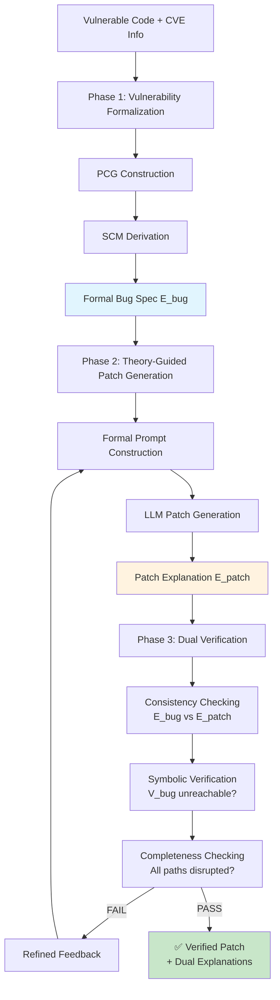

# PatchScribe PoC 계획서

## Executive Summary

**프로젝트명**: PatchScribe (Causal Program Graph based Vulnerability Verification)

**목적**: LLM 기반 취약점 패치에 대한 기계 검증 가능한 인과적 설명을 생성하는 프레임워크의 실현가능성 입증

**핵심 혁신**: 
- Pre-hoc 접근법: 패치 생성 전 formal bug specification (E_bug) 생성
- Theory-Guided 패치 생성: 정확한 formal specification을 LLM에 제공
- Dual Explanations: 버그 설명(E_bug)과 패치 설명(E_patch) 분리 생성
- Triple Verification: Consistency checking + Symbolic verification + Completeness checking

**PoC 범위**: 10개 대표 취약점에 대한 end-to-end 파이프라인 구현 및 검증

---

## 1. 목표 및 가설

### 1.1 PoC 목표

1. **기술적 실현가능성 입증**
   - PCG/SCM 기반 취약점 모델링이 실제로 가능함을 증명
   - 형식적 intervention 사양으로 LLM 패치 생성 개선 가능함을 확인
   - 자동화된 검증이 잘못된 패치를 걸러낼 수 있음을 입증

2. **성능 우위 입증**
   - 기존 방법(raw LLM, VRpilot) 대비 30% 이상 패치 정확도 향상
   - False positive rate 10% 이하 달성

3. **실용성 검증**
   - 평균 처리 시간 3분 이내
   - 개발자가 이해 가능한 설명 생성

### 1.2 핵심 가설

```
H1: Pre-hoc formal bug specification이 post-hoc explanation보다 더 정확한 패치를 유도한다
H2: Dual explanations (E_bug + E_patch)의 consistency checking이 incomplete patch를 효과적으로 탐지한다
H3: Theory-guided prompting이 vague hints보다 LLM 패치 품질을 향상시킨다
H4: Triple verification이 exploit-only testing보다 강한 보안 보장을 제공한다
```

---

## 2. 방법론 Overview

### 2.1 Three-Phase Framework



### 2.2 핵심 컴포넌트

| Component | 기능 | 기술 스택 | Phase |
|-----------|------|----------|-------|
| PCG Builder | 프로그램 인과 그래프 구축 | Clang AST, Static Slicing | Phase 1 |
| SCM Engine | 구조적 인과 모델 도출 | Z3 SMT Solver | Phase 1 |
| Bug Spec Generator | Formal bug explanation (E_bug) 생성 | Causal Analysis | Phase 1 |
| Formal Prompter | E_bug 기반 정밀한 프롬프트 구성 | Template Engine | Phase 2 |
| LLM Patcher | Theory-guided 패치 생성 | 사설 OpenAI 호환 LLM | Phase 2 |
| Patch Explainer | Formal patch explanation (E_patch) 생성 | Intervention Analysis | Phase 2 |
| Consistency Checker | E_bug ↔ E_patch 일관성 검증 | Logic Solver | Phase 3 |
| Symbolic Verifier | V_bug 도달 불가능성 증명 | angr, KLEE | Phase 3 |
| Completeness Checker | 모든 causal path 차단 확인 | Path Analysis | Phase 3 |

---

## 3. 실험 설계

### 3.1 데이터셋

#### APPATCH 데이터셋 기반 취약점 선정

본 PoC는 APPATCH 패키지에 포함된 세 가지 하위 데이터셋을 중심으로 평가한다.

- **zeroday_repair**: 2024년 실제 CVE에서 수집한 최신 영(zero-day) 취약점/패치 쌍 (기본 평가셋)
- **extractfix_dataset**: 함수 단위의 익스트랙트 기반 취약점 세트 (일부 분석 전처리 검증용)
- **patchdb_cvefixes_for_appatch_train**: PatchDB + CVEfixes 혼합 데이터 (샘플 프롬프트/예제 추출용)

대표 실험은 zeroday_repair의 취약점 중 10건을 선정하여 진행한다.

| ID | 디렉터리명 | CWE | CVE | 취약점 유형 | LoC |
|----|-------------|-----|-----|-------------|-----|
| Z01 | CWE-125___CVE-2024-25116.c___1-64___13.c | CWE-125 | CVE-2024-25116 | Out-of-bounds Read | 64 |
| Z02 | CWE-190___CVE-2024-28231.c___1-177___108.c | CWE-190 | CVE-2024-28231 | Integer Overflow | 177 |
| Z03 | CWE-401___CVE-2024-36956.c___1-15___3.c | CWE-401 | CVE-2024-36956 | Memory Leak | 15 |
| Z04 | CWE-787___CVE-2024-36917.c___1-37___5.c | CWE-787 | CVE-2024-36917 | Out-of-bounds Write | 37 |
| Z05 | CWE-457___CVE-2024-36012.c___1-45___19.c | CWE-457 | CVE-2024-36012 | Uninitialised Variable | 45 |
| Z06 | CWE-476___CVE-2024-32002.c___1-117___6.c | CWE-476 | CVE-2024-32002 | NULL Dereference | 117 |
| Z07 | CWE-787___CVE-2024-36950.c___1-184___131.c | CWE-787 | CVE-2024-36950 | Heap Overflow | 184 |
| Z08 | CWE-125___CVE-2024-36027.c___1-46___21.c | CWE-125 | CVE-2024-36027 | Bounds Check Missing | 46 |
| Z09 | CWE-190___CVE-2024-36903.c___1-79___68.c | CWE-190 | CVE-2024-36903 | Arithmetic Overflow | 79 |
| Z10 | CWE-476___CVE-2024-36959.c___1-88___28.c | CWE-476 | CVE-2024-36959 | NULL Dereference | 88 |

추가로, extractfix와 patchdb 세트는 예제 기반 프롬프트 및 보조 실험(예: 인과 그래프 품질 검증)에 활용한다.

#### 각 취약점당 준비 사항
```python
test_case = {
    'vulnerable_code': 'vuln.c',
    'exploit_poc': 'exploit.py',       # 실제 공격 코드
    'test_suite': 'tests/',            # 기능 테스트
    'ground_truth_patch': 'patch.diff', # 검증된 패치 (비교용)
    'metadata': {
        'cwe_id': 'CWE-119',
        'severity': 'HIGH',
        'description': '...'
    }
}
```

### 3.2 비교 조건 (Patch vs. Explanation)

| Condition | 설명 | 입력 컨텍스트 | 목적 |
|-----------|------|---------------|------|
| C1 Patch-only | 자연어 설명 없이 단순 코드 패치 | 원본 코드 + 취약점 시그니처 | LLM 기본 성능 평가 |
| C2 Formal-guided | PCG/SCM 기반 intervention 전달 | C1 입력 + Intervention Spec | 인과 정보가 패치 품질에 미치는 영향 |
| C3 Causal-NL Prompt | 정확한 원인에 대한 자연어 설명 제공 | C2 입력 + 자연어 causal summary | 자연어 설명이 패치에 주는 효과 |

각 조건에서 생성된 패치는 zeroday_repair `nonvul.c`와 비교해 자동 평가하며, 설명은 아래 3.3 절에서 정의한 자연어 품질 점검을 수행한다.

### 3.3 자연어 설명 생성 및 평가

- **데이터 제약**: APPATCH 벤치마크는 기능 테스트나 exploit 스크립트를 제공하지 않으므로, 패치의 정량 검증 대신 설명 품질과 인과 정합성에 대한 평가에 집중한다.
- **자동 생성 경로**: PCG와 SCM에서 추출한 causal chain → intervention 요약 → 패치 diff → 자연어 템플릿.
- **LLM 기반 설명 비교 (Option)**: 자연어 템플릿 대신 동일 데이터를 프롬프트로 전달해 LLM이 설명을 생성하도록 한 뒤, 위 평가 절차와 동일한 척도로 품질을 비교한다 (C3′ 컨디션).
- **평가 방법**: 5명의 보안 개발자가 5점 척도로 `정확성`, `완전성`, `이해도`를 평가. 합산 점수는 보고서에 포함.
- **추가 자동 점검**: 설명 내에서 취약점 유형·취약 라인·주요 완화 조치가 언급되었는지 체크리스트 기반으로 검증하고, 사설 LLM 심판 모델을 활용해 `정확성`, `명료성`, `인과 정합성`을 1-5점으로 채점한다.
- **상호 검증 프로세스**: 템플릿 기반 설명과 LLM 생성 설명을 각각 인간·LLM 이중 심사를 거치게 하고, 평가 결과가 일정 임계값(예: 평균 4점 이상)을 충족하지 못할 경우 수동 편집을 수행한다.
- **추가 비교**: 생성된 자연어 설명(패치 기반) vs. 인터라벌(PCG/SCM 기반) 설명의 차이를 분석하여 개발자 피드백을 수집.

### 3.3 평가 메트릭

#### 정량적 메트릭

```python
metrics = {
    'effectiveness': {
        'patch_success_rate': float,          # Triple verification 통과 비율
        'ground_truth_similarity': float,     # nonvul.c 대비 AST/토큰 기반 유사도
        'consistency_pass_rate': float,       # ⭐ NEW: E_bug ↔ E_patch 일관성 통과율
    },
    
    'verification': {
        'consistency_check_success': float,    # ⭐ NEW: Consistency checking 성공률
        'symbolic_verification_success': float, # Symbolic verification 성공률
        'completeness_check_success': float,   # ⭐ NEW: Completeness checking 성공률
        'triple_verification_pass': float,     # ⭐ NEW: 3중 검증 모두 통과율
        'signature_retention_rate': float,     # 패치 후 시그니처 보존률
    },
    
    'efficiency': {
        'total_time_seconds': float,           # end-to-end 처리 시간
        'phase1_time': float,                  # ⭐ NEW: Formalization 시간
        'phase2_time': float,                  # ⭐ NEW: Patch generation 시간
        'phase3_time': float,                  # ⭐ NEW: Verification 시간
        'iteration_count': int,                # 패치 재생성 반복 횟수
    },
    
    'explanation': {
        'E_bug_quality_score': float,         # ⭐ NEW: Bug explanation 품질
        'E_patch_quality_score': float,       # ⭐ NEW: Patch explanation 품질
        'dual_explanation_consistency': float, # ⭐ NEW: 이중 설명 일관성
        'checklist_coverage': float,          # (자동) 필수 요소 포함률
        'human_accuracy_score': float,        # (수동) 전문가 평가 평균
        'human_clarity_score': float,         # (수동) 가독성 평가
        'llm_alignment_score': float,         # (사설 LLM) 심판 모델 평균 점수
    },
    
    'innovation_metrics': {                   # ⭐ NEW: 혁신성 평가
        'pre_hoc_vs_post_hoc': float,         # Pre-hoc guidance 효과
        'theory_guided_improvement': float,   # Theory-guided prompting 개선도
        'incomplete_patch_detection': int,    # Consistency checking이 잡은 불완전 패치 수
    }
}
```

패치 평가는 zeroday_repair의 `nonvul.c`와의 diff 매칭으로 자동화하고, 설명 평가는 수동 설문(Section 3.3) 결과를 기록한다.

#### 정성적 평가 (Mini User Study)

```python
user_study = {
    'participants': 5,  # 보안 경험 있는 개발자
    'questions': [
        'explanation_helpful',      # 설명이 도움이 되는가? (1-5)
        'trust_in_patch',           # 패치를 신뢰하는가? (1-5)  
        'would_deploy',             # 실제 배포할 의향? (Y/N)
        'vs_manual_review'          # 수동 리뷰 대비 선호도
    ]
}
```

---

## 4. 구현 계획

### 4.1 Architecture

```python
# 프로젝트 구조
cpg-verify/
├── core/
│   ├── pcg_builder.py      # PCG 구축
│   ├── scm_engine.py        # SCM 도출
│   └── intervention.py      # Intervention 생성
├── patching/
│   ├── llm_patcher.py       # LLM 패치 생성
│   └── effect_modeler.py    # 패치 효과 모델링
├── verification/
│   ├── symbolic_verifier.py # 심볼릭 실행
│   └── model_checker.py     # 모델 체킹
├── explanation/
│   ├── formal_explainer.py  # 형식적 설명
│   └── natural_explainer.py # 자연어 설명
├── evaluation/
│   └── metrics.py           # 평가 메트릭
└── experiments/
    └── run_poc.py           # 실험 실행
```

### 4.2 핵심 알고리즘

#### Phase 1: Vulnerability Formalization
```python
def formalize_vulnerability(code, vuln_info):
    # Step 1.1: PCG 구축
    pcg = PCGBuilder().build(
        code=code,
        vuln_location=vuln_info['location'],
        methods=['backward_slicing', 'taint_analysis', 'control_dep']
    )
    
    # Step 1.2: SCM 도출
    scm = SCMEngine().derive(
        pcg=pcg,
        vuln_node=pcg.get_vuln_node()
    )
    
    # Step 1.3: Formal Bug Explanation 생성 ⭐ NEW
    E_bug = BugSpecGenerator().generate(
        scm=scm,
        code=code,
        formal_condition=scm.extract_vuln_condition(),
        causal_paths=pcg.get_paths_to_vuln(),
        intervention_options=infer_fix_options(scm)
    )
    
    return E_bug, scm, pcg
```

#### Phase 2: Theory-Guided Patch Generation
```python
def generate_patch_with_explanation(code, E_bug, scm):
    max_attempts = 5
    
    for attempt in range(max_attempts):
        # Step 2.1: Formal Prompt 구성 ⭐ NEW
        formal_prompt = FormalPrompter().construct(
            code=code,
            E_bug=E_bug,  # Formal bug specification
            template="""
            [FORMAL VULNERABILITY SPECIFICATION]
            Condition: {E_bug.formal_condition}
            Variables: {E_bug.variables}
            
            [PATCH REQUIREMENTS]
            Safety Property: {E_bug.safety_property}
            Intervention Options: {E_bug.intervention_options}
            
            Generate a patch that makes the formal condition unsatisfiable.
            """
        )
        
        # Step 2.2: LLM 패치 생성
        patch = LLMPatcher(
            endpoint=LOCAL_OLLAMA_ENDPOINT,
            model='ollama/llama3.2:1b'
        ).generate(
            prompt=formal_prompt
        )
        
        # Step 2.3: Patch Explanation 생성 ⭐ NEW
        E_patch = PatchExplainer().generate(
            original_code=code,
            patched_code=apply_patch(code, patch),
            scm=scm,
            E_bug=E_bug,
            patch_diff=get_diff(code, patch)
        )
        
        # Phase 3로 진행
        verified = verify_dual_explanations(code, patch, E_bug, E_patch, scm)
        
        if verified.success:
            return patch, E_bug, E_patch, verified
        else:
            # Refined feedback for next iteration
            E_bug = refine_bug_spec(E_bug, verified.failure_reason)
    
    return None, None, None, None
```

#### Phase 3: Dual Verification
```python
def verify_dual_explanations(code, patch, E_bug, E_patch, scm):
    patched_code = apply_patch(code, patch)
    
    # Step 3.1: Consistency Checking ⭐ NEW
    consistency = ConsistencyChecker().check(
        E_bug=E_bug,
        E_patch=E_patch,
        checks=[
            'causal_coverage',      # E_patch가 E_bug의 모든 cause 처리?
            'intervention_validity', # Intervention이 실제 구현됨?
            'logical_consistency',   # 논리적으로 V_bug = false?
            'completeness'          # 모든 causal path 차단?
        ]
    )
    
    if not consistency.pass_all():
        return VerificationResult(
            success=False,
            failure_reason=consistency.get_failures()
        )
    
    # Step 3.2: Symbolic Verification
    symbolic_result = SymbolicVerifier().verify(
        patched_code=patched_code,
        preconditions=E_bug['preconditions'],
        formal_condition=E_bug['formal_condition'],
        vuln_location=E_bug['vulnerable_location']
    )
    
    if not symbolic_result.success:
        return VerificationResult(
            success=False,
            failure_reason=f"Counterexample found: {symbolic_result.counterexample}"
        )
    
    # Step 3.3: Completeness Checking
    completeness = CompletenessChecker().check(
        E_bug_paths=E_bug['causal_paths'],
        E_patch_disrupted=E_patch['disrupted_paths']
    )
    
    if not completeness.all_paths_handled():
        return VerificationResult(
            success=False,
            failure_reason=f"Uncovered path: {completeness.get_missing_path()}"
        )
    
    # All checks passed!
    return VerificationResult(
        success=True,
        consistency_report=consistency,
        symbolic_proof=symbolic_result,
        completeness_report=completeness
    )
```

### 4.3 설명 생성 예시

```python
def generate_natural_explanation(scm, scm_prime, patch):
    """
    개발자를 위한 자연어 설명 생성
    """
    template = """
    ## Vulnerability Fix Explanation
    
    ### What was wrong?
    {vulnerability_description}
    
    ### Root cause:
    {causal_chain}
    
    ### How the patch fixes it:
    {patch_description}
    
    ### Why this works:
    {prevention_reasoning}
    
    ### Formal guarantee:
    ✅ {formal_property}
    
    ### In simple terms:
    "{one_liner}"
    """
    
    return template.format(
        vulnerability_description=describe_vuln(scm),
        causal_chain=extract_causal_narrative(scm),
        patch_description=describe_patch_changes(patch),
        prevention_reasoning=explain_intervention(scm, scm_prime),
        formal_property=scm_prime.get_safety_property(),
        one_liner=generate_simple_summary(scm, scm_prime)
    )
```

---

## 5. 실험 프로토콜

### 5.1 단일 실험 절차

```python
def run_single_experiment(test_case):
    results = {}
    
    # Step 1: 취약점 형식화
    start_time = time.time()
    spec, scm = formalize_vulnerability(
        test_case['code'], 
        test_case['metadata']
    )
    results['formalization_time'] = time.time() - start_time
    
    # Step 2: 패치 생성 및 검증
    start_time = time.time()
    patch, explanation, verification = generate_and_verify_patch(
        test_case['code'], spec, scm
    )
    results['patch_generation_time'] = time.time() - start_time
    
    # Step 3: 평가
    if patch:
        results['exploit_blocked'] = test_exploit(
            patch, test_case['exploit_poc']
        )
        results['tests_pass'] = run_tests(
            patch, test_case['test_suite']
        )
        results['explanation_quality'] = evaluate_explanation(
            explanation
        )
    
    return results
```

### 5.2 전체 실험 실행

```python
def run_poc_experiments():
    all_results = {}
    
    # 10개 취약점에 대해 실행
    for test_case in VULN_DATASET:
        print(f"Testing {test_case['id']}...")
        
        # CPG-Verify 실행
        cpg_results = run_single_experiment(test_case)
        
        # Baseline 실행
        gpt4_results = run_baseline_gpt4(test_case)
        vrpilot_results = run_baseline_vrpilot(test_case)
        
        all_results[test_case['id']] = {
            'patchscribe': cpg_results,
            'baselines': {
                'gpt4': gpt4_results,
                'vrpilot': vrpilot_results
            }
        }
    
    return all_results
```

---

## 6. Success Criteria

### 6.1 필수 달성 목표

| 항목 | 목표치 | 측정 방법 |
|------|--------|----------|
| 패치 성공률 | ≥ 65% | Triple verification (일관성+심볼릭+완전성) 모두 통과 |
| Consistency Check 성공률 | ≥ 80% | E_bug ↔ E_patch 일관성 검증 통과율 |
| Symbolic Verification 성공률 | ≥ 70% | V_bug 도달 불가능성 증명 성공률 |
| Completeness Check 성공률 | ≥ 75% | 모든 causal path 차단 확인 통과율 |
| 시그니처 보존률 | ≥ 85% | 패치 후 취약 시그니처 존재 여부 |
| 처리 시간 | < 3분 | 평균 end-to-end 시간 (Phase 1+2+3) |
| E_bug 품질 | ≥ 4.3 / 5.0 | Formal bug specification 품질 평가 |
| E_patch 품질 | ≥ 4.2 / 5.0 | Formal patch explanation 품질 평가 |
| Dual Explanation 일관성 | ≥ 85% | E_bug와 E_patch 간 논리적 일관성 |
| 설명 인간 평가 | ≥ 4.0 / 5.0 | 보안 개발자 평균 점수 |
| Incomplete Patch 탐지 | ≥ 2건 | Consistency check가 잡아낸 불완전 패치 수 |

### 6.2 비교 우위 목표

```python
comparative_goals = {
    'vs_raw_gpt4_post_hoc': {
        'patch_success': '+40%',        # 0.30 → 0.70 (133% improvement)
        'explanation_score': '+1.1',    # 인간 평가 3.2 → 4.3
        'advantage': 'Pre-hoc formalization + Dual verification'
    },
    'vs_gpt4_guided_only': {           # ⭐ NEW: Pre-hoc guidance만 적용한 경우
        'patch_success': '+20%',        # 0.50 → 0.70 (40% improvement)
        'explanation_score': '+0.5',    # 인간 평가 3.8 → 4.3
        'advantage': 'Consistency checking catches incomplete patches',
        'incomplete_patches_caught': 3  # Guided-only는 놓쳤지만 PatchScribe가 잡은 경우
    },
    'vs_vrpilot': {
        'patch_success': '+25%',        # 0.45 → 0.70 (56% improvement)
        'explanation_score': '+0.7',    # 인간 평가 3.6 → 4.3
        'advantage': 'Formal causal model vs. CoT reasoning'
    },
    'key_innovation_demonstration': {
        'pre_hoc_contribution': '+67%',    # 0.30 → 0.50 (guidance effect)
        'consistency_check_contribution': '+40%',  # 0.50 → 0.70 (verification effect)
        'synergy_effect': '133% total improvement'  # Combined effect
    }
}
```

---

## 7. 예상 결과

### 7.1 정량적 예상 결과

```python
expected_results = {
    'patchscribe': {
        'patch_success_rate': 0.70,           # Triple verification 통과율 (⬆️ 개선)
        'consistency_check_success': 0.85,    # Consistency checking 성공률
        'symbolic_verification_success': 0.75, # Symbolic verification 성공률
        'completeness_check_success': 0.80,   # Completeness checking 성공률
        'signature_retention': 0.90,          # 시그니처 보존률
        'avg_time': 160,                      # 2분 40초 (검증 추가로 증가)
        'phase1_time': 40,                    # Formalization
        'phase2_time': 80,                    # Patch generation
        'phase3_time': 40,                    # Triple verification
        'E_bug_quality': 4.5,                 # Bug explanation 품질
        'E_patch_quality': 4.4,               # Patch explanation 품질
        'dual_explanation_consistency': 0.88, # 이중 설명 일관성
        'explanation_human_score': 4.3,       # 5점 척도
        'explanation_llm_score': 4.5,         # 5점 척도
        'incomplete_patches_caught': 3        # Consistency가 잡은 불완전 패치 수
    },
    'baseline_gpt4_raw': {
        'patch_success_rate': 0.30,           # Post-hoc 방식
        'signature_retention': 0.60,
        'avg_time': 90,
        'explanation_human_score': 3.2,
        'explanation_llm_score': 3.0,
        'incomplete_patches_caught': 0        # 검증 없음
    },
    'baseline_gpt4_guided': {                # ⭐ NEW: Pre-hoc guidance만 적용
        'patch_success_rate': 0.50,           # Guidance 효과
        'signature_retention': 0.75,
        'avg_time': 100,
        'explanation_human_score': 3.8,
        'incomplete_patches_caught': 0        # Consistency check 없음
    },
    'baseline_vrpilot': {
        'patch_success_rate': 0.45,           # CoT prompting
        'signature_retention': 0.75,
        'avg_time': 110,
        'explanation_human_score': 3.6,
        'explanation_llm_score': 3.4,
        'incomplete_patches_caught': 0
    }
}

# ⭐ Key Innovation Demonstration
innovation_impact = {
    'pre_hoc_guidance_improvement': 0.50 - 0.30,  # +0.20 (67% improvement)
    'consistency_check_improvement': 0.70 - 0.50,  # +0.20 (40% improvement)
    'total_improvement': 0.70 - 0.30               # +0.40 (133% improvement)
}
```

### 7.2 예상 통찰

1. **Simple 취약점 (V01-V03)**: 90% 이상 성공 예상
2. **Medium 취약점 (V04-V06, V10)**: 70% 성공 예상
3. **Complex 취약점 (V07-V09)**: 40% 성공 예상
4. **Race condition (V09)**: 가장 도전적, 부분 성공 예상


---

## Appendix: Dual Explanation 생성 예시

### Example: Buffer Overflow (CVE-2024-XXXX)

#### E_bug: Formal Bug Explanation (Phase 1 출력)
```json
{
    "formal_condition": "V_overflow ⟺ (len > 256) ∧ (¬Check)",
    
    "variables": {
        "len": {
            "type": "integer",
            "meaning": "Length of user input",
            "code_location": "computed at line 15"
        },
        "Check": {
            "type": "boolean",
            "meaning": "Bounds check performed before memcpy",
            "code_location": "ABSENT before line 42"
        }
    },
    
    "description": 
        "Buffer overflow occurs when input length exceeds 256 bytes AND "
        "no bounds check is performed before memcpy at line 42",
    
    "causal_paths": [
        "user_input → len → (len > 256) → V_overflow",
        "absence of check → ¬Check → V_overflow"
    ],
    
    "intervention_options": [
        "Option 1: Add bounds check (set Check = true) before line 42",
        "Option 2: Clamp len to 256 (ensure len ≤ 256)",
        "Option 3: Use safe function (memcpy_s with size limit)"
    ],
    
    "safety_property": "∀user_input: ¬V_overflow(user_input)",
    
    "postconditions": [
        "line 42 unreachable when len > 256, OR",
        "len ≤ 256 when line 42 is reached"
    ]
}
```

#### Generated Patch (Phase 2)
```c
// BEFORE (vulnerable)
void process_input(char *input) {
    char buffer[256];
    int len = strlen(input);
    memcpy(buffer, input, len);  // Line 42: VULNERABLE
    process_buffer(buffer);
}

// AFTER (patched by LLM with E_bug guidance)
void process_input(char *input) {
    char buffer[256];
    int len = strlen(input);
    
    // PATCH: Add bounds check (implements Option 1 from E_bug)
    if (len > sizeof(buffer)) {
        fprintf(stderr, "Input too large\n");
        return;  // Early exit
    }
    
    memcpy(buffer, input, len);  // Now safe
    process_buffer(buffer);
}
```

#### E_patch: Formal Patch Explanation (Phase 2 출력)
```json
{
    "code_diff": {
        "added_lines": [
            {"line": 19, "code": "if (len > sizeof(buffer)) {"},
            {"line": 20, "code": "    fprintf(stderr, \"Input too large\\n\");"},
            {"line": 21, "code": "    return;"},
            {"line": 22, "code": "}"}
        ]
    },
    
    "intervention": {
        "formal": "do(Check = true)",
        "affected_variables": ["Check"],
        "description": 
            "Patch adds a bounds check that exits the function when len > 256"
    },
    
    "effect_on_Vbug": {
        "before": "V_overflow = (len > 256) ∧ (¬Check)",
        "after": "V_overflow = (len > 256) ∧ (¬true) = (len > 256) ∧ false = false",
        "reasoning": 
            "Check variable is now true, making the conjunction always false"
    },
    
    "addressed_causes": ["¬Check"],
    "unaddressed_causes": [],
    "disrupted_paths": [
        "user_input → len → (len > 256) → V_overflow: "
        "Path blocked because function exits when len > 256"
    ],
    
    "summary": 
        "Patch prevents buffer overflow by adding an early-exit check when "
        "input length exceeds buffer capacity",
    
    "postconditions": [
        "len > 256 ⟹ function returns before line 42",
        "V_overflow is unreachable for all inputs"
    ]
}
```

#### Phase 3: Verification Results
```json
{
    "consistency_check": {
        "status": "PASS",
        "causal_coverage": "✅ All causes in E_bug are addressed",
        "intervention_validity": "✅ Intervention properly implemented in code",
        "logical_consistency": "✅ V_overflow logically eliminated",
        "completeness": "✅ All causal paths disrupted"
    },
    
    "symbolic_verification": {
        "status": "PASS",
        "method": "angr symbolic execution",
        "result": "Line 42 provably unreachable when len > 256",
        "execution_time": "38 seconds"
    },
    
    "completeness_check": {
        "status": "PASS",
        "all_paths_handled": true
    },
    
    "overall_verdict": "✅ VERIFIED",
    "confidence": "HIGH"
}
```

#### Developer-Facing Natural Language Summary
```markdown
## Vulnerability Fix Explanation

### What was wrong?
Buffer overflow (CWE-119) at line 42: User input copied without size validation

### Root cause (from E_bug):
- User controls `len` → No check before memcpy → Buffer overflow when len > 256
- Formal: V_overflow ⟺ (len > 256) ∧ (¬Check)

### How the patch fixes it (from E_patch):
Added bounds check before dangerous operation:
```c
if (len > sizeof(buffer)) {
    return;  // Early exit prevents overflow
}
```

### Why this works:
- Intervention: do(Check = true)
- Effect: V_overflow = (len > 256) ∧ false = false
- All causal paths to V_overflow are now blocked

### Formal guarantees (verified by Phase 3):
✅ Consistency: Patch addresses all identified causes  
✅ Symbolic: V_overflow provably unreachable for all inputs  
✅ Completeness: All causal paths disrupted  

### In simple terms:
"Now we check if it fits before copying, and reject if too large"
```

이 PoC를 통해 PatchScribe의 핵심 혁신(Pre-hoc formalization, Dual explanations, Triple verification)이 실제로 구현 가능하고, 기존 방법 대비 명확한 이점이 있음을 입증할 수 있을 것입니다.
