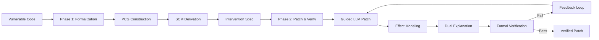

# CPG-Verify PoC 계획서

## Executive Summary

**프로젝트명**: CPG-Verify (Causal Program Graph based Vulnerability Verification)

**목적**: LLM 기반 취약점 패치에 대한 기계 검증 가능한 인과적 설명을 생성하는 프레임워크의 실현가능성 입증

**핵심 혁신**: 
- Program Causal Graph(PCG)와 Structural Causal Model(SCM)을 통한 취약점 형식화
- LLM 패치 생성과 형식적 검증의 통합
- 검증 가능하면서도 인간이 이해 가능한 이중 설명 생성

**PoC 범위**: 10개 대표 취약점에 대한 end-to-end 파이프라인 구현 및 검증

---

## 1. 목표 및 가설

### 1.1 PoC 목표

1. **기술적 실현가능성 입증**
   - PCG/SCM 기반 취약점 모델링이 실제로 가능함을 증명
   - 형식적 intervention 사양으로 LLM 패치 생성 개선 가능함을 확인
   - 자동화된 검증이 잘못된 패치를 걸러낼 수 있음을 입증

2. **성능 우위 입증**
   - 기존 방법(raw LLM, VRpilot) 대비 30% 이상 패치 정확도 향상
   - False positive rate 10% 이하 달성

3. **실용성 검증**
   - 평균 처리 시간 3분 이내
   - 개발자가 이해 가능한 설명 생성

### 1.2 핵심 가설

```
H1: 인과 모델 기반 형식화가 더 정확한 패치를 생성한다
H2: 형식적 검증이 incorrect patch를 효과적으로 필터링한다  
H3: 이중 설명(형식+자연어)이 개발자 신뢰도를 향상시킨다
```

---

## 2. 방법론 Overview

### 2.1 Two-Phase Framework



### 2.2 핵심 컴포넌트

| Component | 기능 | 기술 스택 |
|-----------|------|----------|
| PCG Builder | 프로그램 인과 그래프 구축 | Clang AST, Static Slicing |
| SCM Engine | 구조적 인과 모델 도출 | Z3 SMT Solver |
| Intervention Generator | 패치 사양 생성 | Constraint Solving |
| LLM Patcher | 가이드된 패치 생성 | GPT-4 API |
| Verifier | 형식적 검증 | angr, CBMC |
| Explainer | 이중 설명 생성 | Template + NLG |

---

## 3. 실험 설계

### 3.1 데이터셋

#### APPATCH 데이터셋 기반 취약점 선정

본 PoC는 APPATCH 패키지에 포함된 세 가지 하위 데이터셋을 중심으로 평가한다.

- **zeroday_repair**: 2024년 실제 CVE에서 수집한 최신 영(zero-day) 취약점/패치 쌍 (기본 평가셋)
- **extractfix_dataset**: 함수 단위의 익스트랙트 기반 취약점 세트 (일부 분석 전처리 검증용)
- **patchdb_cvefixes_for_appatch_train**: PatchDB + CVEfixes 혼합 데이터 (샘플 프롬프트/예제 추출용)

대표 실험은 zeroday_repair의 취약점 중 10건을 선정하여 진행한다.

| ID | 디렉터리명 | CWE | CVE | 취약점 유형 | LoC |
|----|-------------|-----|-----|-------------|-----|
| Z01 | CWE-125___CVE-2024-25116.c___1-64___13.c | CWE-125 | CVE-2024-25116 | Out-of-bounds Read | 64 |
| Z02 | CWE-190___CVE-2024-28231.c___1-177___108.c | CWE-190 | CVE-2024-28231 | Integer Overflow | 177 |
| Z03 | CWE-401___CVE-2024-36956.c___1-15___3.c | CWE-401 | CVE-2024-36956 | Memory Leak | 15 |
| Z04 | CWE-787___CVE-2024-36917.c___1-37___5.c | CWE-787 | CVE-2024-36917 | Out-of-bounds Write | 37 |
| Z05 | CWE-457___CVE-2024-36012.c___1-45___19.c | CWE-457 | CVE-2024-36012 | Uninitialised Variable | 45 |
| Z06 | CWE-476___CVE-2024-32002.c___1-117___6.c | CWE-476 | CVE-2024-32002 | NULL Dereference | 117 |
| Z07 | CWE-787___CVE-2024-36950.c___1-184___131.c | CWE-787 | CVE-2024-36950 | Heap Overflow | 184 |
| Z08 | CWE-125___CVE-2024-36027.c___1-46___21.c | CWE-125 | CVE-2024-36027 | Bounds Check Missing | 46 |
| Z09 | CWE-190___CVE-2024-36903.c___1-79___68.c | CWE-190 | CVE-2024-36903 | Arithmetic Overflow | 79 |
| Z10 | CWE-476___CVE-2024-36959.c___1-88___28.c | CWE-476 | CVE-2024-36959 | NULL Dereference | 88 |

추가로, extractfix와 patchdb 세트는 예제 기반 프롬프트 및 보조 실험(예: 인과 그래프 품질 검증)에 활용한다.

#### 각 취약점당 준비 사항
```python
test_case = {
    'vulnerable_code': 'vuln.c',
    'exploit_poc': 'exploit.py',       # 실제 공격 코드
    'test_suite': 'tests/',            # 기능 테스트
    'ground_truth_patch': 'patch.diff', # 검증된 패치 (비교용)
    'metadata': {
        'cwe_id': 'CWE-119',
        'severity': 'HIGH',
        'description': '...'
    }
}
```

### 3.2 비교 조건 (Patch vs. Explanation)

| Condition | 설명 | 입력 컨텍스트 | 목적 |
|-----------|------|---------------|------|
| C1 Patch-only | 자연어 설명 없이 단순 코드 패치 | 원본 코드 + 취약점 시그니처 | LLM 기본 성능 평가 |
| C2 Formal-guided | PCG/SCM 기반 intervention 전달 | C1 입력 + Intervention Spec | 인과 정보가 패치 품질에 미치는 영향 |
| C3 Causal-NL Prompt | 정확한 원인에 대한 자연어 설명 제공 | C2 입력 + 자연어 causal summary | 자연어 설명이 패치에 주는 효과 |

각 조건에서 생성된 패치는 zeroday_repair `nonvul.c`와 비교해 자동 평가하며, 설명은 아래 3.3 절에서 정의한 자연어 품질 점검을 수행한다.

### 3.3 자연어 설명 생성 및 평가

- **자동 생성 경로**: PCG와 SCM에서 추출한 causal chain → intervention 요약 → 패치 diff → 자연어 템플릿.
- **LLM 기반 설명 비교 (Option)**: 자연어 템플릿 대신 동일 데이터를 프롬프트로 전달해 LLM이 설명을 생성하도록 한 뒤, 위 평가 절차와 동일한 척도로 품질을 비교한다 (C3′ 컨디션).
- **평가 방법**: 5명의 보안 개발자가 5점 척도로 `정확성`, `완전성`, `이해도`를 평가. 합산 점수는 보고서에 포함.
- **추가 비교**: 생성된 자연어 설명(패치 기반) vs. 인터라벌(PCG/SCM 기반) 설명의 차이를 분석하여 개발자 피드백을 수집.

### 3.3 평가 메트릭

#### 정량적 메트릭

```python
metrics = {
    'effectiveness': {
        'patch_success_rate': float,        # 취약점 제거 성공률
        'exploit_prevention': float,        # PoC 차단률
        'functionality_preservation': float,# 기능 유지율
        'ground_truth_match_rate': float,   # nonvul.c 대비 일치율
    },
    
    'verification': {
        'true_positive_rate': float,
        'false_positive_rate': float,
        'verification_coverage': float,
    },
    
    'efficiency': {
        'total_time_seconds': float,
        'iteration_count': int,
        'memory_usage_mb': float,
    },
    
    'explanation': {
        'completeness_score': float,   # (자동) 필수 요소 포함률
        'correctness_score': float,    # (수동) 전문가 평가 평균
        'clarity_score': float,        # (수동) 가독성 평가
    }
}
```

패치 평가는 zeroday_repair의 `nonvul.c`와의 diff 매칭으로 자동화하고, 설명 평가는 수동 설문(Section 3.3) 결과를 기록한다.

#### 정성적 평가 (Mini User Study)

```python
user_study = {
    'participants': 5,  # 보안 경험 있는 개발자
    'questions': [
        'explanation_helpful',      # 설명이 도움이 되는가? (1-5)
        'trust_in_patch',           # 패치를 신뢰하는가? (1-5)  
        'would_deploy',             # 실제 배포할 의향? (Y/N)
        'vs_manual_review'          # 수동 리뷰 대비 선호도
    ]
}
```

---

## 4. 구현 계획

### 4.1 Architecture

```python
# 프로젝트 구조
cpg-verify/
├── core/
│   ├── pcg_builder.py      # PCG 구축
│   ├── scm_engine.py        # SCM 도출
│   └── intervention.py      # Intervention 생성
├── patching/
│   ├── llm_patcher.py       # LLM 패치 생성
│   └── effect_modeler.py    # 패치 효과 모델링
├── verification/
│   ├── symbolic_verifier.py # 심볼릭 실행
│   └── model_checker.py     # 모델 체킹
├── explanation/
│   ├── formal_explainer.py  # 형식적 설명
│   └── natural_explainer.py # 자연어 설명
├── evaluation/
│   └── metrics.py           # 평가 메트릭
└── experiments/
    └── run_poc.py           # 실험 실행
```

### 4.2 핵심 알고리즘

#### Phase 1: 취약점 형식화
```python
def formalize_vulnerability(code, vuln_info):
    # 1. PCG 구축 (3-way analysis)
    pcg = PCGBuilder().build(
        static_analysis(code),
        dynamic_analysis(code, test_inputs),
        symbolic_analysis(code)
    )
    
    # 2. SCM 도출
    scm = SCMEngine().derive(pcg)
    
    # 3. Intervention 사양 생성
    spec = InterventionGenerator().generate(
        scm, 
        vulnerability_condition=scm.get_vuln_condition()
    )
    
    return spec, scm
```

#### Phase 2: 패치 생성 및 검증
```python
def generate_and_verify_patch(code, spec, scm):
    max_attempts = 5
    
    for attempt in range(max_attempts):
        # 1. 가이드된 패치 생성
        patch = LLMPatcher().generate(
            code=code,
            intervention_spec=spec,
            model='gpt-4-turbo'
        )
        
        # 2. 패치 효과 모델링
        scm_prime = EffectModeler().model(scm, patch)
        
        # 3. 이중 설명 생성
        explanation = DualExplainer().generate(
            formal=generate_formal_explanation(scm, scm_prime),
            natural=generate_natural_explanation(scm, scm_prime, patch)
        )
        
        # 4. 형식적 검증
        verification = FormalVerifier().verify(
            patched_code=apply_patch(code, patch),
            specification=scm_prime.get_safety_property(),
            explanation=explanation['formal']
        )
        
        if verification.success:
            return patch, explanation, verification
        else:
            # 실패 피드백으로 spec 개선
            spec = refine_spec(spec, verification.counterexample)
    
    return None, None, None
```

### 4.3 설명 생성 예시

```python
def generate_natural_explanation(scm, scm_prime, patch):
    """
    개발자를 위한 자연어 설명 생성
    """
    template = """
    ## Vulnerability Fix Explanation
    
    ### What was wrong?
    {vulnerability_description}
    
    ### Root cause:
    {causal_chain}
    
    ### How the patch fixes it:
    {patch_description}
    
    ### Why this works:
    {prevention_reasoning}
    
    ### Formal guarantee:
    ✅ {formal_property}
    
    ### In simple terms:
    "{one_liner}"
    """
    
    return template.format(
        vulnerability_description=describe_vuln(scm),
        causal_chain=extract_causal_narrative(scm),
        patch_description=describe_patch_changes(patch),
        prevention_reasoning=explain_intervention(scm, scm_prime),
        formal_property=scm_prime.get_safety_property(),
        one_liner=generate_simple_summary(scm, scm_prime)
    )
```

---

## 5. 실험 프로토콜

### 5.1 단일 실험 절차

```python
def run_single_experiment(test_case):
    results = {}
    
    # Step 1: 취약점 형식화
    start_time = time.time()
    spec, scm = formalize_vulnerability(
        test_case['code'], 
        test_case['metadata']
    )
    results['formalization_time'] = time.time() - start_time
    
    # Step 2: 패치 생성 및 검증
    start_time = time.time()
    patch, explanation, verification = generate_and_verify_patch(
        test_case['code'], spec, scm
    )
    results['patch_generation_time'] = time.time() - start_time
    
    # Step 3: 평가
    if patch:
        results['exploit_blocked'] = test_exploit(
            patch, test_case['exploit_poc']
        )
        results['tests_pass'] = run_tests(
            patch, test_case['test_suite']
        )
        results['explanation_quality'] = evaluate_explanation(
            explanation
        )
    
    return results
```

### 5.2 전체 실험 실행

```python
def run_poc_experiments():
    all_results = {}
    
    # 10개 취약점에 대해 실행
    for test_case in VULN_DATASET:
        print(f"Testing {test_case['id']}...")
        
        # CPG-Verify 실행
        cpg_results = run_single_experiment(test_case)
        
        # Baseline 실행
        gpt4_results = run_baseline_gpt4(test_case)
        vrpilot_results = run_baseline_vrpilot(test_case)
        
        all_results[test_case['id']] = {
            'cpg_verify': cpg_results,
            'baselines': {
                'gpt4': gpt4_results,
                'vrpilot': vrpilot_results
            }
        }
    
    return all_results
```

---

## 6. Success Criteria

### 6.1 필수 달성 목표

| 항목 | 목표치 | 측정 방법 |
|------|--------|----------|
| 패치 성공률 | ≥ 70% | 7/10 취약점 성공 |
| Exploit 차단 | 100% | 모든 성공 패치가 PoC 차단 |
| False Positive | < 10% | 잘못된 패치 승인율 |
| 처리 시간 | < 3분 | 평균 end-to-end 시간 |
| 설명 완전성 | ≥ 90% | 필수 요소 포함률 |

### 6.2 비교 우위 목표

```python
comparative_goals = {
    'vs_raw_gpt4': {
        'patch_success': '+50%',  # 30% → 70%
        'explanation': 'N/A → Complete'
    },
    'vs_vrpilot': {
        'patch_success': '+25%',  # 45% → 70%
        'verification': 'None → Formal'
    }
}
```

---

## 7. 예상 결과

### 7.1 정량적 예상 결과

```python
expected_results = {
    'cpg_verify': {
        'success_rate': 0.70,        # 70%
        'false_positive': 0.05,      # 5%
        'avg_time': 120,             # 2분
        'explanation_score': 0.90    # 90%
    },
    'baseline_gpt4': {
        'success_rate': 0.30,
        'false_positive': None,      # 검증 없음
        'avg_time': 10,
        'explanation_score': 0.40
    },
    'baseline_vrpilot': {
        'success_rate': 0.45,
        'false_positive': None,
        'avg_time': 45,
        'explanation_score': 0.60
    }
}
```

### 7.2 예상 통찰

1. **Simple 취약점 (V01-V03)**: 90% 이상 성공 예상
2. **Medium 취약점 (V04-V06, V10)**: 70% 성공 예상
3. **Complex 취약점 (V07-V09)**: 40% 성공 예상
4. **Race condition (V09)**: 가장 도전적, 부분 성공 예상


---

## Appendix: 설명 생성 예시

### Buffer Overflow 패치 설명
```markdown
## Vulnerability Fix Explanation

### What was wrong?
Buffer overflow (CWE-119) at line 42: User input copied without size validation

### Root cause:
User controls `len` → No check before memcpy → Buffer overflow when len > 256

### How the patch fixes it:
Added bounds check before dangerous operation:
```c
if (len > BUFFER_SIZE) {
    return ERROR_INVALID_SIZE;
}
```

### Why this works:
The patch ensures len ≤ BUFFER_SIZE before memcpy, making overflow impossible

### Formal guarantee:
✅ ∀ execution paths: len > 256 ⟹ ¬reaches(memcpy)

### In simple terms:
"Now we check if it fits before copying"
```

이 PoC를 통해 CPG-Verify의 핵심 아이디어가 실제로 구현 가능하고, 기존 방법 대비 명확한 이점이 있음을 입증할 수 있을 것입니다.
